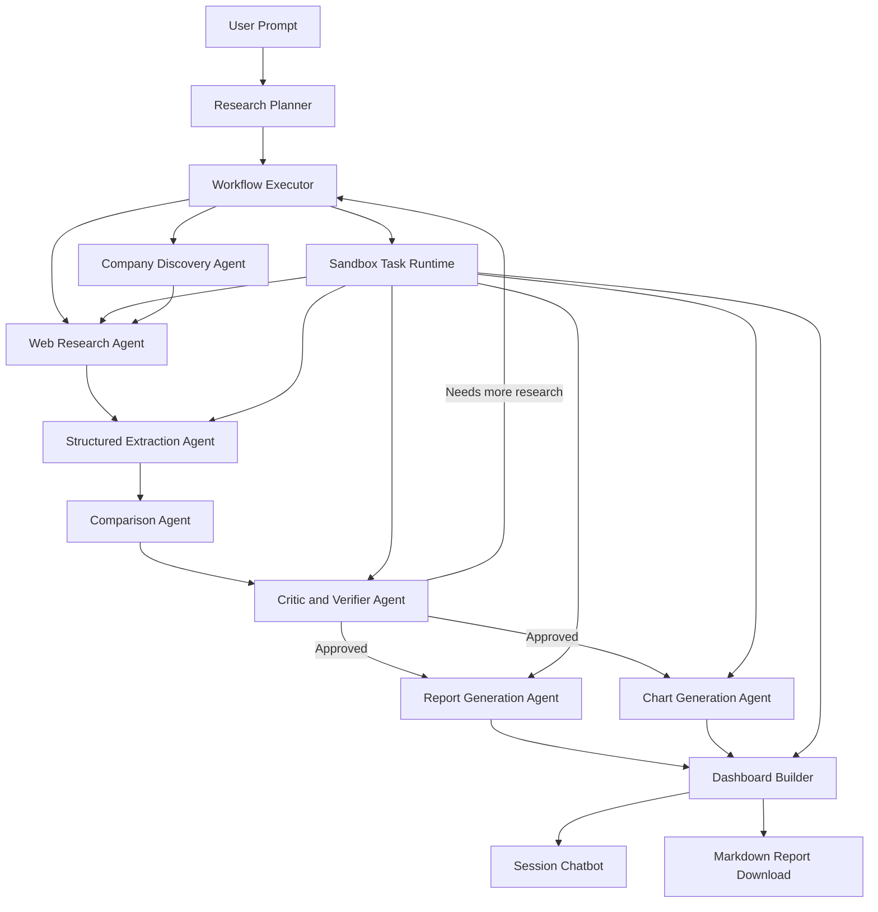

# Market Mapper Scope

## 1. Product Summary

Market Mapper is an AI-assisted market research system that turns a broad research prompt into a structured competitive analysis dashboard.

Example user prompt:

> Analyze 4 of the largest companies in AI customer support and create a comparison report.

The system should identify relevant companies, collect public information from company websites and other public sources, extract structured findings, compare the companies across useful dimensions, and present the results in a dashboard that is easy to understand. The dashboard should include a written report, comparison tables, charts, and a downloadable Markdown report.

The product should feel similar to a ChatGPT-style research session. A user starts a new session, enters one main research prompt, and receives a dashboard built around that prompt. After the dashboard is generated, the user can use a collapsible right-side chatbot to ask follow-up questions about the research, the companies, the source material, and the generated analysis.

If the user wants to research a different market, they should start a new session with a new overarching prompt.

## 2. Target Users

Market Mapper is intended for founders, product managers, operators, and business researchers who need a fast, structured understanding of a market category or competitive landscape.

Primary user needs:

- Understand the major companies in a market.
- Compare pricing, features, positioning, target customers, and public signals.
- Turn scattered website and public-source information into a clean report.
- Ask follow-up questions against the collected research.
- Export the final findings as a Markdown report.

## 3. Core User Flow

1. The user opens a new research session.
2. The user enters a high-level market research prompt.
3. The system scopes the prompt into a concrete research plan.
4. The system discovers candidate companies that match the prompt.
5. The system selects the best target companies for analysis.
6. The system researches each selected company using public sources.
7. The system extracts and normalizes the findings into a consistent schema.
8. The system compares the companies across relevant dimensions.
9. The system verifies whether the findings are complete and well-supported.
10. The system generates a dashboard with:
    - An executive summary.
    - A company comparison table.
    - Pricing and packaging comparisons where available.
    - Feature and capability comparisons.
    - Positioning and target customer analysis.
    - Charts for relevant statistics and comparison dimensions.
    - Source references.
    - A downloadable Markdown report.
11. The user can open a collapsible right-side chatbot and ask questions about the collected research and generated analysis.
12. To research a new topic, the user starts a new session.

## 4. Agent Architecture

Market Mapper should be implemented as a LangGraph-based multi-agent workflow inspired by a planner and executor architecture. The system should have one central planning agent that decides what work needs to happen, one central executor that coordinates specialist agents, and several assistant agents that perform focused tasks such as company discovery, web research, structured extraction, comparison, chart generation, and report writing.

The workflow should not behave like one long single-agent prompt. It should behave like a coordinated research graph where each step produces structured state that downstream agents can validate, reuse, and display in the dashboard.

The project should also use sandbox agents wherever they add clear value. Sandbox agents should be used for work that benefits from isolated compute, filesystem access, browser automation, command execution, temporary artifacts, dependency isolation, or reproducible snapshots. The main workflow executor should stay in the trusted application harness, while sandbox agents should handle execution-heavy tasks in a controlled environment.

High-level flow:

1. The user submits a market research prompt.
2. The planner turns the prompt into a research plan.
3. The executor runs the plan by calling specialist agents.
4. The executor launches sandbox-backed tasks when an agent needs isolated compute or artifact generation.
5. Specialist agents collect, extract, compare, chart, and summarize the research.
6. The critic and verifier agent reviews the research state.
7. If the research is incomplete, the executor sends the workflow back to the relevant specialist agent.
8. If the research is complete, the report and dashboard are generated.
9. The finished dashboard becomes the knowledge base for the session chatbot.

Suggested graph shape:

Each agent should have a clear responsibility and should pass structured state to the next stage.

### 4.1 Research Planner

Purpose:

Turn a vague or broad user prompt into a concrete research plan.

Responsibilities:

- Identify the market category, target segment, geography, company count, and comparison dimensions implied by the prompt.
- Decide what information should be collected for the user’s goal.
- Produce a research plan that can guide discovery and data extraction.
- Ask for clarification only when the prompt is too ambiguous to act on safely.

Example output:

- Market category: AI customer support.
- Company count: 4.
- Discovery criteria: largest or most prominent companies by public visibility, funding, customer base, and category relevance.
- Comparison dimensions: pricing, features, integrations, target customers, positioning, strengths, weaknesses, and public proof points.

### 4.2 Workflow Executor

Purpose:

Coordinate the specialist agents and manage the research graph.

Responsibilities:

- Read the research plan and decide which specialist agents should run.
- Pass the right structured state to each agent.
- Track progress across discovery, research, extraction, comparison, verification, report generation, and chart generation.
- Handle retry loops when the critic and verifier agent finds missing or weak information.
- Stop unnecessary work when the research plan is already satisfied.
- Ensure the final dashboard only uses approved research state.
- Decide when a specialist task should run in a sandbox and what files, credentials, network access, or mounted state it is allowed to use.

Expected behavior:

- The executor should call the company discovery agent before deep web research unless the user names exact companies.
- The executor should run structured extraction after web research, not before enough source material has been collected.
- The executor should call the critic and verifier before final report generation.
- The executor should route the workflow back to the specific agent responsible for a missing field instead of restarting the entire workflow.
- The executor should keep orchestration, audit logs, approvals, user state, billing, and recovery state outside the sandbox.

### 4.3 Company Discovery Agent

Purpose:

Find candidate companies that match the scoped research plan.

Responsibilities:

- Search the web and public sources for companies in the target market.
- Build a candidate list with evidence for why each company belongs in the market.
- Rank candidates based on the prompt criteria, such as size, relevance, visibility, funding, enterprise presence, or market leadership.
- Select the final 3-5 companies for deeper research unless the user requested a specific count.

### 4.4 Web Research Agent

Purpose:

Collect relevant public information for each selected company.

Responsibilities:

- Visit official company websites and relevant public pages.
- Collect information about products, pricing, features, integrations, industries, customer segments, case studies, and positioning.
- Use public sources when official information is incomplete.
- Preserve source URLs for traceability.
- Capture enough context for later extraction and verification.
- Store source snapshots or extracted artifacts when a sandbox agent is used.

Suggested tools:

- Playwright for dynamic pages.
- BeautifulSoup, Trafilatura, or similar tools for page extraction.
- Search APIs or browser-based search for public discovery.
- Sandbox agents for browser automation, page capture, source snapshots, and temporary extraction artifacts.

### 4.5 Structured Extraction Agent

Purpose:

Convert messy research findings into a consistent schema.

Responsibilities:

- Normalize raw text and page findings into structured company profiles.
- Extract fields such as pricing model, core features, target customers, integrations, positioning, proof points, and source URLs.
- Mark unavailable or uncertain data explicitly instead of inventing values.
- Preserve evidence and confidence levels for important claims.

Expected output:

- A validated Pydantic model for each company.
- A consistent set of comparison-ready fields.
- Source-backed claims that can be used by the report and chatbot.

### 4.6 Comparison Agent

Purpose:

Perform the competitive analysis.

Responsibilities:

- Compare companies across the dimensions selected by the research planner.
- Identify similarities, differences, strengths, weaknesses, and tradeoffs.
- Highlight positioning differences and likely ideal customer profiles.
- Produce structured comparison outputs that can feed tables, charts, and narrative report sections.

### 4.7 Critic and Verifier Agent

Purpose:

Review the research and analysis for completeness, support, and consistency.

Responsibilities:

- Check whether each selected company has enough source-backed information.
- Identify missing fields, unsupported claims, or inconsistent comparisons.
- Approve the analysis when it is complete enough for the dashboard.
- Send the workflow back for more research when important gaps remain.
- Ensure the final report distinguishes facts from analysis or inference.

### 4.8 Report Generation Agent

Purpose:

Generate the written comparison report.

Responsibilities:

- Create a clear executive summary.
- Explain the selected companies and why they were chosen.
- Summarize each company profile.
- Write the competitive comparison across relevant dimensions.
- Include practical takeaways for the target user.
- Generate a downloadable Markdown report with source references.

### 4.9 Chart Generation Agent

Purpose:

Create chart-ready data and dashboard visualizations.

Responsibilities:

- Determine which charts are useful for the prompt and available data.
- Generate chart data from structured company profiles and comparisons.
- Support visualizations such as feature coverage, pricing availability, target segment focus, positioning maps, and scorecards.
- Avoid charts when the underlying data is too sparse or uncertain.
- Use a sandbox agent when chart generation requires Python execution, local files, rendered image artifacts, or reproducible chart snapshots.

### 4.10 Dashboard Builder

Purpose:

Assemble the approved research, report, charts, and source references into the final user-facing dashboard.

Responsibilities:

- Render the executive summary, tables, charts, source list, and report download.
- Keep the dashboard aligned with the original user prompt and approved research plan.
- Surface missing or unavailable data clearly.
- Store the final research state so the session chatbot can answer follow-up questions.
- Use sandbox-generated artifacts where appropriate, such as chart files, Markdown exports, page snapshots, and validation outputs.

### 4.11 Session Chatbot

Purpose:

Answer follow-up questions about the completed dashboard and the research collected for the current session.

Responsibilities:

- Use the final approved research state, extracted claims, source documents, comparison results, charts, and report.
- Cite or reference source-backed claims when answering factual questions.
- Explain when an answer depends on inference rather than directly collected evidence.
- Refuse to answer from unrelated sessions or uncollected data.

### 4.12 Sandbox Agent Usage

Purpose:

Add sandbox-backed execution wherever it makes the system safer, more reliable, or more capable.

Sandbox agents should be used for:

- Web research tasks that require browser automation, JavaScript rendering, screenshot capture, or saved page snapshots.
- Data extraction tasks that need temporary files, parsing scripts, or repeatable cleanup of messy HTML and text.
- Chart generation tasks that need Python, Pandas, plotting libraries, generated images, or chart data validation.
- Report generation tasks that need to render, validate, or package Markdown artifacts.
- Dashboard build tasks that need temporary preview files or generated assets.
- Verification tasks that need to run consistency checks against structured JSON, CSV, or Markdown outputs.

Sandbox agents should not be used by default for:

- The research planner, unless it needs to inspect uploaded files or artifacts.
- The workflow executor, because orchestration, approvals, audit logs, tracing, billing, and recovery state should remain in the trusted application harness.
- The session chatbot, unless it needs to inspect or regenerate a specific artifact from the completed research session.

Sandbox requirements:

- Give each sandbox task the smallest useful set of files, credentials, network permissions, and mounted state.
- Treat sandbox output as untrusted until it is validated by the structured extraction or critic and verifier steps.
- Persist only approved artifacts back into the research session.
- Keep source snapshots and generated artifacts tied to the relevant `WorkflowRun` and `AgentTask`.
- Prefer sandbox snapshots for long-running or retryable research tasks so failed work can be resumed or inspected.

## 5. Dashboard Requirements

The dashboard should present the final research in a way that is easy to follow. It should help the user move from high-level conclusions to detailed evidence.

Required dashboard sections:

- Prompt summary and scoped research plan.
- Executive summary.
- Selected companies and rationale.
- Company comparison table.
- Feature comparison matrix.
- Pricing and packaging comparison where public pricing is available.
- Positioning analysis.
- Charts based on relevant structured data.
- Key takeaways.
- Source list.
- Markdown report download.

Design principles:

- The first screen should show the most important answer, not just a loading state or generic landing page.
- Tables and charts should make comparison easy without requiring the user to read the full report first.
- Unavailable or uncertain data should be labeled clearly.
- Source references should be visible enough for trust, but not distract from the main analysis.

## 6. Follow-Up Chatbot Requirements

Each generated dashboard should include a collapsible chatbot in the right sidebar.

The chatbot should answer questions using only the session’s collected research, structured data, generated analysis, and source references.

Example follow-up questions:

- Which company is best for enterprise customers?
- Which tools publish pricing?
- What are the biggest feature differences?
- Which company has the clearest AI positioning?
- What sources support the pricing comparison?

Requirements:

- The chatbot should be scoped to the current research session.
- It should cite or reference supporting collected data when answering factual questions.
- It should say when the collected data does not contain enough information.
- It should not silently use unrelated data from other sessions.

## 7. Data Model

The system should maintain structured state throughout the workflow.

Suggested core entities:

- ResearchSession
- ResearchPlan
- WorkflowRun
- AgentTask
- SandboxTask
- SandboxArtifact
- CompanyCandidate
- CompanyProfile
- SourceDocument
- ExtractedClaim
- ComparisonDimension
- ComparisonResult
- VerificationResult
- ChartSpec
- Report
- DashboardState

Suggested company profile fields:

- Company name
- Website
- Market category
- Product summary
- Target customers
- Core features
- AI capabilities
- Integrations
- Pricing model
- Public pricing details
- Packaging or plans
- Positioning statement
- Differentiators
- Customer proof points
- Notable public metrics
- Strengths
- Weaknesses or gaps
- Source URLs
- Confidence level

## 8. Source and Verification Standards

Market Mapper should prioritize official company sources when available. Public third-party sources may be used to fill gaps, but the system should track where each claim came from.

Rules:

- Do not invent pricing, features, metrics, or claims.
- Label missing information as unavailable.
- Label uncertain analysis as an inference.
- Keep source URLs for important claims.
- Prefer recent and official sources for company details.
- Run the critic and verifier step before generating the final dashboard.

## 9. MVP Scope

The first usable version should support one research prompt per session and generate one complete dashboard.

MVP capabilities:

- Accept a broad market research prompt.
- Scope the prompt into a research plan.
- Discover and select 3-5 companies.
- Research each company using public web sources.
- Extract structured company profiles.
- Compare companies across pricing, features, positioning, and target customers.
- Use sandbox agents for execution-heavy tasks such as browser research, extraction artifacts, chart generation, and report export when useful.
- Generate an executive summary, comparison tables, charts, and a Markdown report.
- Provide a collapsible session-specific chatbot for follow-up questions.

Out of scope for MVP:

- User accounts and team collaboration.
- Private data uploads.
- Continuous monitoring of markets over time.
- Automatic scheduled report refreshes.
- CRM or external database integrations.
- Fully automated claims about revenue, market share, or customer counts when public evidence is weak.

## 10. Technical Direction

The project should use the stack defined in `AGENTS.md`:

- Python for the application and workflow logic.
- LangGraph for agent orchestration.
- LangChain and OpenAI API for model calls and tool use.
- OpenAI Agents SDK sandbox agents where isolated execution, filesystem access, command execution, or artifact generation is useful.
- Playwright for browser-based research.
- BeautifulSoup and Trafilatura for web extraction.
- Pydantic for structured schemas.
- Pandas for tabular comparison data.
- Jinja2 for report and Markdown generation.
- Redis for workflow state or queued tasks where useful.
- Docker and Kubernetes for deployment when the product is ready to move beyond local development.

The implementation should keep agents modular, state explicit, and outputs validated before they are used by downstream steps.

The application should separate the trusted harness from sandbox compute. The trusted harness should own orchestration, model calls, tool routing, approvals, tracing, recovery, and durable run state. Sandbox compute should be used for model-directed execution that reads or writes files, runs commands, uses browser tooling, generates report or chart artifacts, and snapshots intermediate state.

## 11. Success Criteria

Market Mapper is successful when a user can enter a broad market research prompt and receive a dashboard that:

- Identifies relevant companies.
- Shows the research plan and selection rationale.
- Compares companies in a structured and readable way.
- Includes useful charts and tables.
- Provides a clear written report.
- Preserves source references.
- Allows follow-up questions through the session chatbot.
- Lets the user download the final report as Markdown.
